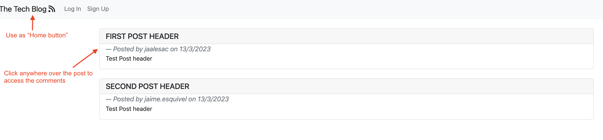
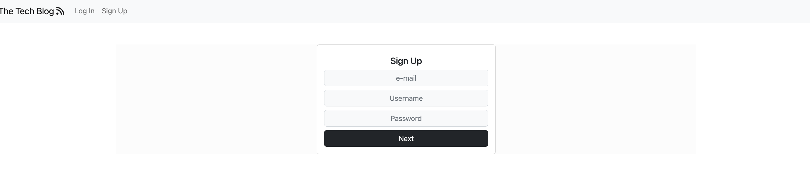
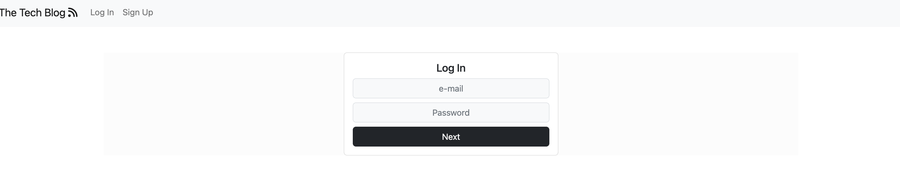
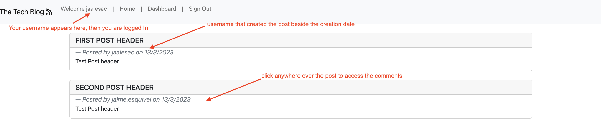
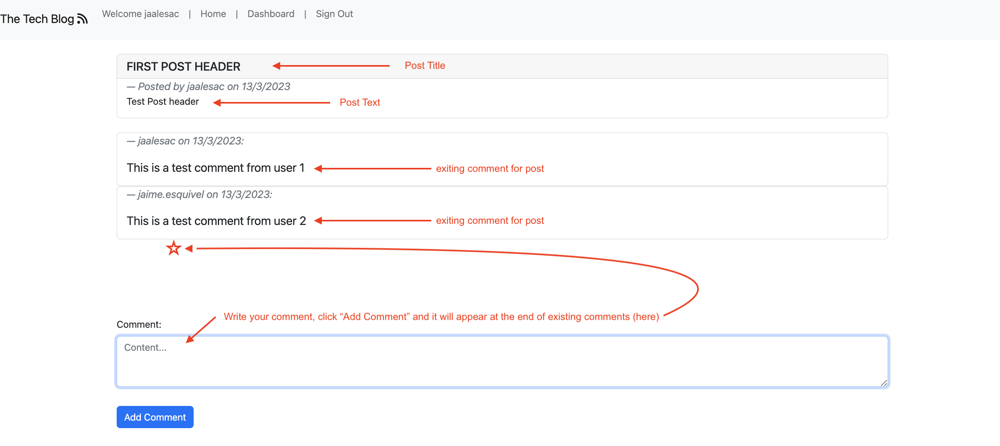
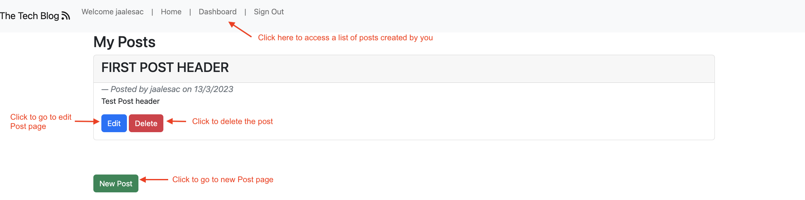
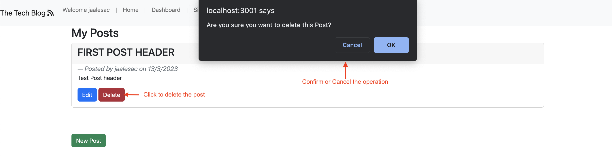
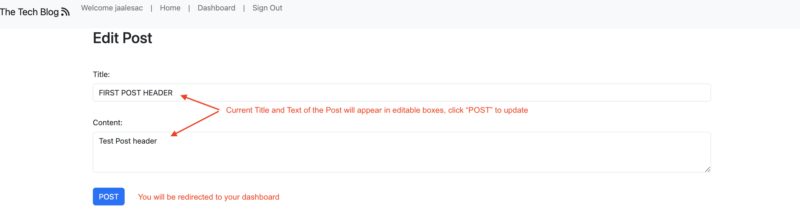
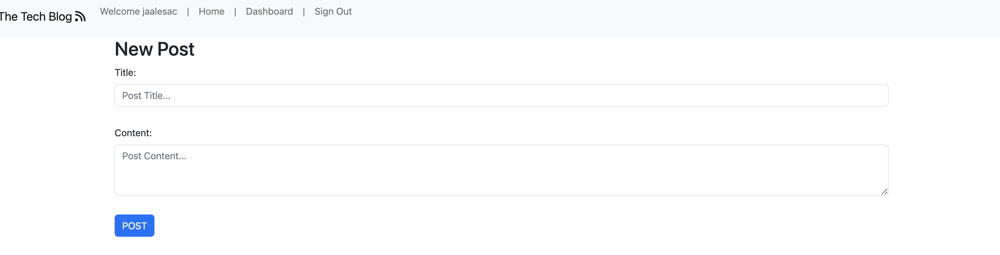

# The Tech Blog

## Description

The tech Blog App allows visitors to see posts written by users and it's comments on any tech topic.  
To participate and be able to create your own posts and comments you need to register.  

App is developed as an MVC using express-handlebars, MySQL and Sequelize.

[Deployed App](https://tech-blog-jaea.herokuapp.com/)

## Usage  

The Home screen displays the posts created by registered users. In this home screen you can only display the posts and comments.  
To create your own posts or participate adding comments to other's posts click on "Sign Up" to register.  

The Sign Up screen allows you to register by creating a new user.  

The Log In screen allows you to sign in using your credentials.  

The Initial screen allows you to see all the posts created in the app. 
You can then click on any of the post to enter the comments section.  

The Post comments screen displays all the comments from you or other users related to a given post.  
You can add a new comment here.  

The Dashboard screen displays all the post created by you.  
Here you can create, edit or delete your posts.  

Delete Post, this can be done from the dashboard screen clicking the delete button.  

The edit Post screen can be accessed via your dashboard, here you can update the contents of an existing post.  

The new Post screen can be accessed via your dashboard, enter here to create a new post.  

## Technologies  
- HTML
- CSS
- JavaScript
- [Node.js](https://nodejs.org/en/)
- [Express Handlebars](https://www.npmjs.com/package/express-handlebars)
- [Express Session](https://www.npmjs.com/package/express-session)
- [Sequelize](https://sequelize.org/)  
- [MySQL](https://www.mysql.com/)  
- [Bcrypt](https://www.npmjs.com/package/bcrypt)

## Licenses

### ISC
https://opensource.org/licenses/ISC    

-- 

## Contributing

Jaime Esquivel https://github.com/jaime-a-esquivel-a

--

## Tests

No tests were developed for this app.

--

## Questions

Please contact the author:

Name: Jaime Esquivel

e-mail: jaime.a.esquivel.a@gmail.com

GitHub User: https://github.com/jaime-a-esquivel-a